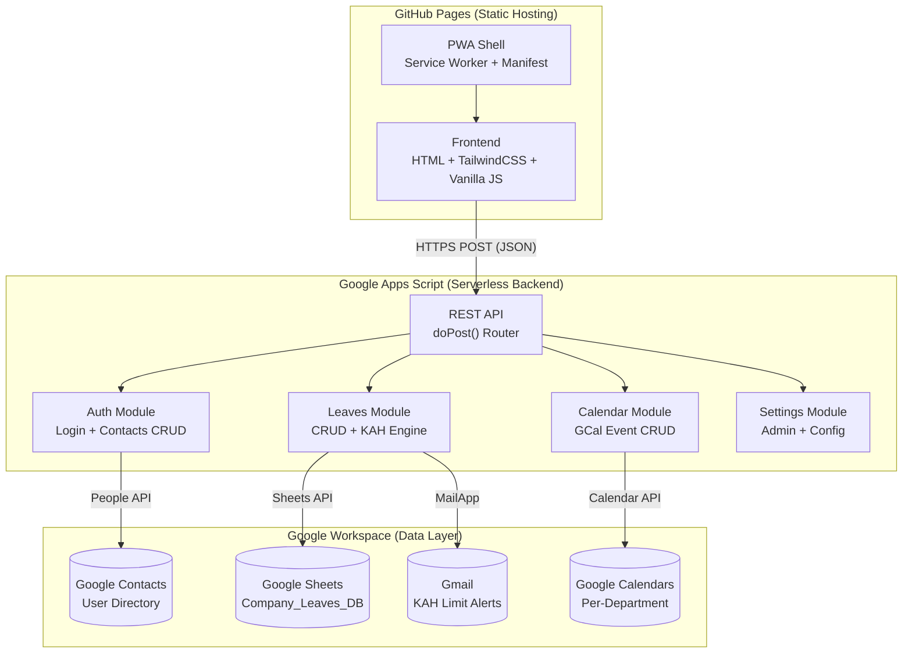
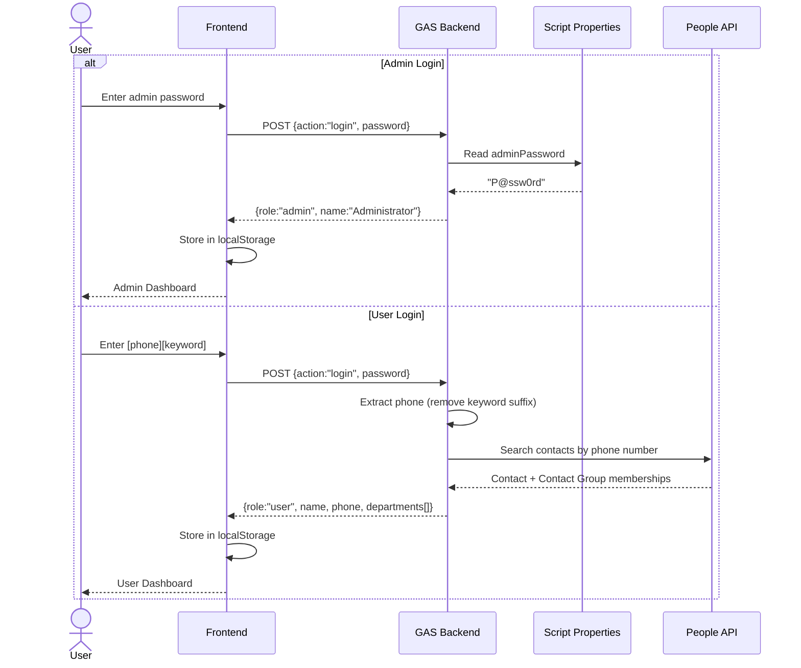
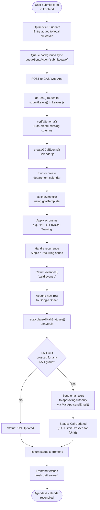
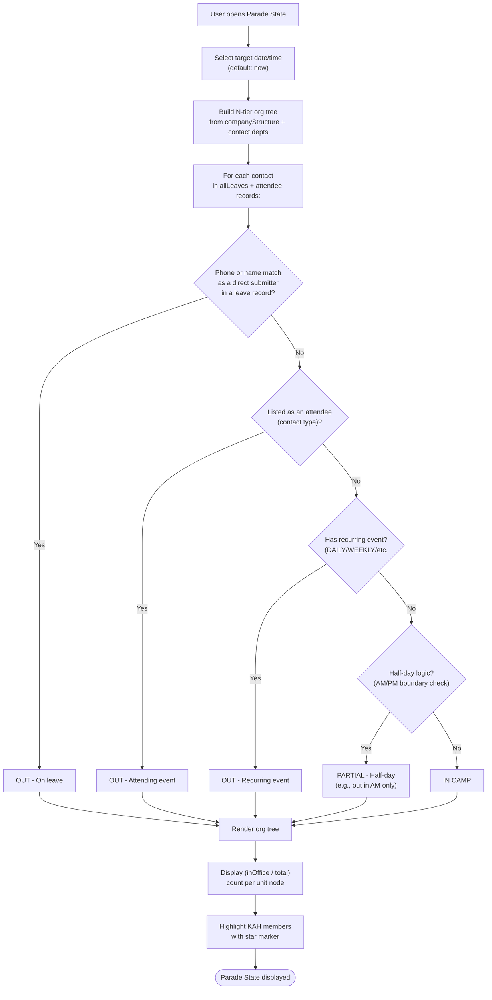
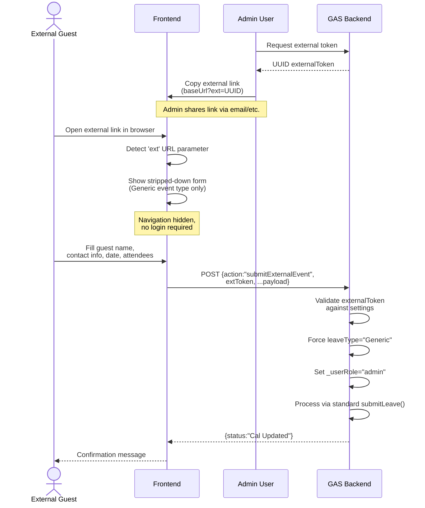

# CloudCalendarMovement-Dev
# https://oncloudnintynine.github.io/Cloud-Calendar-Movement-Dev/

Here is a comprehensive, step-by-step documentation guide designed specifically for your `README.md`. It covers everything from the initial scratch setup to CI/CD pipeline configuration, and long-term maintenance protocols.

***

# ☁️ Cloudy - Setup & Developer Guide

Cloudy is a serverless, Progressive Web App (PWA) built to manage company personnel, leave/event records, and Key Appointment Holder (KAH) constraints. It utilizes a static front-end hosted on GitHub Pages, communicating with a backend powered entirely by Google Apps Script (GAS) and Google Workspace APIs (Drive, Sheets, Contacts, Calendar, Gmail).

---

## Table of Contents

- [Architecture Overview](#-architecture-overview)
- [Authentication Flow](#-authentication-flow)
- [Step 1: Backend Setup](#-step-1-backend-setup-google-apps-script)
- [Step 2: Frontend Setup](#-step-2-frontend-setup)
- [Step 3: CI/CD Pipeline](#-step-3-cicd-pipeline-automated-backend-deployment)
- [Step 4: Initial App Configuration](#-step-4-initial-app-configuration)
- [Leave & Event Submission Flow](#-leave--event-submission-flow)
- [Parade State System](#-parade-state-system)
- [External Booking Portal](#-external-booking-portal)
- [Long-Term Maintenance & Enhancement Guide](#-long-term-maintenance--enhancement-guide)

---

## 🏗️ Architecture Overview



### Components

| Layer | Technology | Role |
|---|---|---|
| **Frontend** | HTML5, TailwindCSS (CDN), Vanilla JS | Static UI hosted on GitHub Pages across 3 environments |
| **Backend** | Google Apps Script (GAS) | Serverless REST API processing GET/POST requests |
| **Database** | Google Sheets, Google Contacts, Google Calendar | Leave/event records, user directory & structure, event visualization |
| **Environments** | Exp, Dev, Prod (3 separate GitHub repos) | Fully isolated staging pipelines |
| **CI/CD** | GitHub Actions + Google Clasp | Auto-deploys backend changes on push |

---

## 🔐 Authentication Flow



### Login Modes

- **Admin**: Default password `P@ssw0rd` (change immediately after setup). Grants full access to settings, user management, and all data.
- **User**: Password is `[phone][keyword]` (e.g., `91234567peace`). The backend strips the keyword suffix, looks up the 8-digit phone in Google Contacts via People API, and returns the user's name and department(s).
- **Admin on Behalf**: Admin can search for any user via Fuse.js fuzzy search and submit leave/events on their behalf using the target user's identity.

### User Registration

New users register through the app: name, mobile, unit, birthday. The backend creates a Google Contact, adds it to the appropriate Contact Group, and invalidates the contacts cache. Once Google syncs (~1 minute), the user can log in with `[phone][keyword]`.

---

## 🚀 Step 1: Backend Setup (Google Apps Script)

1. **Create the Script Project:**
   * Go to [script.google.com](https://script.google.com/) and create a **New Project**.
   * Name it `Cloud Moves Backend`.
2. **Enable Google Workspace Services:**
   * On the left sidebar, click on **Services** (the `+` icon).
   * Find and add the **People API**.
3. **Import Backend Code:**
   * Create files matching the exact names in the `backend/` folder of the repository (`Code.gs`, `Auth.gs`, `Calendar.gs`, `Leaves.gs`, `Settings.gs`, `Github.gs`).
   * *Note: GAS uses the `.gs` extension instead of `.js`.* Copy and paste the respective contents into each file.
   * Open the project settings (gear icon) and check **"Show 'appsscript.json' manifest file in editor"**. Overwrite the `appsscript.json` with the one from the repo.
4. **Initialize the Database:**
   * Open `Code.gs`.
   * Select the `INITIAL_SETUP` function from the dropdown in the top toolbar and click **Run**.
   * Google will prompt you to authorize the script. Click **Review Permissions**, choose your Google Account, click **Advanced**, and proceed to the script.
   * *This function will automatically create a new Google Sheet named `Company_Leaves_DB` in your Google Drive and set up all default configuration properties.*
5. **Deploy the Web App:**
   * Click the **Deploy** button (top right) -> **New deployment**.
   * Click the gear icon next to "Select type" and choose **Web app**.
   * **Description**: `Initial Deployment`
   * **Execute as**: `Me` *(Crucial: This ensures the app uses your account's Drive/Contacts)*.
   * **Who has access**: `Anyone` *(Crucial: Allows the frontend to communicate with it anonymously; the app handles its own auth)*.
   * Click **Deploy**.
   * **Copy the Web App URL** and the **Deployment ID**. Save these for later.

---

## 🖥️ Step 2: Frontend Setup

1. **Configure the API Endpoint:**
   * Open `frontend/js/core/config.js` in your code editor.
   * Replace the `PROD_URL`, `DEV_URL`, and `EXP_URL` with the **Web App URLs** corresponding to their respective deployments.
   * Set `const ENV = 'Prod';` (or 'Dev' / 'Exp') appropriately for the environment you are configuring.
2. **Deploy the Frontend:**
   * Push your code to your GitHub repository.
   * Go to your repository settings -> **Pages**.
   * Set the source to deploy from the `main` branch (root directory).
   * Your app will now be accessible at `https://[your-username].github.io/[repo-name]/`.

---

## 🤖 Step 3: CI/CD Pipeline (Automated Backend Deployment)

To allow GitHub to push updates directly to Google Apps Script automatically, you must generate `clasp` (Google's CLI tool) credentials. You can do this entirely in your browser using **GitHub Codespaces** without needing to install anything locally.

```mermaid
flowchart LR
    DEV["Developer pushes<br/>to main branch"] --> FILTER{"backend/<br/>folder changed?"}
    FILTER -->|No| SKIP["Deployment skipped"]
    FILTER -->|Yes| ACTIONS["GitHub Actions<br/>workflows/deploy.yml"]
    ACTIONS --> CHECKOUT["Checkout repository"]
    CHECKOUT --> SETUP["Setup Node.js v24"]
    SETUP --> INSTALL["npm install -g @google/clasp"]
    INSTALL --> CONFIG["Write ~/.clasprc.json<br/>from Secrets.CLASP_CREDS"]
    CONFIG --> CLASPJSON["Write .clasp.json<br/>with Secrets.SCRIPT_ID"]
    CLASPJSON --> PUSH["clasp push --force<br/>(overwrites GAS code)"]
    PUSH --> DEPLOY["clasp deploy -i<br/>Secrets.DEPLOYMENT_ID"]
    DEPLOY --> LIVE["Web App URL updated<br/>(same URL, new version)"]
```



### Setup Instructions

1. **Generate Clasp Credentials via GitHub Codespaces:**
   * On your GitHub repository page, click the green **<> Code** button, switch to the **Codespaces** tab, and click **Create codespace on main**. A browser-based VS Code environment will open.
   * In the terminal at the bottom, run: `npm install -g @google/clasp`
   * Next, run: `clasp login --no-localhost`
   * The terminal will provide a long Google URL. Ctrl+Click (or Cmd+Click) to open it in a new tab.
   * Log in with the Google Account hosting your Apps Script backend and click **Allow**.
   * Copy the resulting URL, paste it back into your Codespace terminal, and hit **Enter**.
   * Run: `cat ~/.clasprc.json`
   * Copy the *entire* JSON output block shown in the terminal. You can now close and delete the Codespace.
2. **Retrieve Project IDs:**
   * **Script ID**: Found in your GAS Project Settings (gear icon) under "IDs".
   * **Deployment ID**: Found via GAS Deploy -> Manage deployments.
3. **Configure GitHub Secrets:**
   * Go to your GitHub Repository -> **Settings** -> **Secrets and variables** -> **Actions**.
   * Add the following Repository Secrets:
     * `CLASP_CREDS`: Paste the JSON copied from Step 1.
     * `SCRIPT_ID`: Paste your Script ID.
     * `DEPLOYMENT_ID`: Paste your Deployment ID.
4. **How it works:**
   Every time you push a change to the `backend/` folder on the `main` branch, GitHub Actions will trigger `.github/workflows/deploy.yml`, pushing the code and updating the exact same Web App URL so your frontend never breaks.

### Cache Busting

Because the app is a PWA, browsers cache the Javascript files. When you push an update to the frontend:
- Go to `index.html` and increment the version numbers at the bottom (e.g., `?v=59` to `?v=60`).
- Update `sw.js` `CACHE_NAME` accordingly (e.g., `cloudy-v120` to `cloudy-v121`).

---

## ⚙️ Step 4: Initial App Configuration

1. **First Login:**
   * Open your frontend URL.
   * The default administrator password is `P@ssw0rd`.
   * Log in to access the App.
2. **Configure Admin Settings:**
   * Go to **Menu -> Admin Settings**.
   * **Admin Password**: Change it immediately.
   * **User Login Keyword**: Set the keyword users append to their phone number to log in (e.g., `peace`).
   * **Organisational Structure**: Build your unit hierarchy.
   * **Register Users**: Register your first batch of users. Google Contacts syncing takes ~1 minute to reflect.

---

## 📋 Leave & Event Submission Flow



### Submission Details

- **Form Types**: Generic, Others, Official Trip, Overseas Leave, Local Leave, or custom event types configured by admin.
- **Events** (type marked `isEvent`): location, datetime pickers, attendees, repeat options, InfoAll toggle.
- **Leaves**: date pickers, AM/PM half-day toggles, overseas fields, attendees.
- **Attendees**: Fuzzy search via Fuse.js over company directory.
- **Offline Support**: If the device is offline, submissions queue locally and sync when connectivity returns. A sync pill indicator shows red (offline with pending), blue (syncing), or green (up to date).

### Edit & Cancel Flow

- **Edit**: Updates the sheet row, deletes old GCal events, creates new ones, re-runs KAH recalculation.
- **Cancel**: Sets status to `Cancelled`, deletes all associated GCal events, re-runs KAH recalculation to heal any limit alerts.

### Two-Way Sync (GCal Reconciliation)

Every `getLeaves()` call checks non-cancelled records with active EventIDs. If all associated GCal events were deleted externally, the record is auto-cancelled. Singapore public holidays are also fetched from Google ICS calendars (cached 6 hours) and merged into the leave feed.

### Database Schema (Google Sheet: `Company_Leaves_DB`)

| Column | Description |
|---|---|
| `ID` | UUID (generated by frontend or backend) |
| `Timestamp` | ISO date string of submission |
| `Phone` | 8-digit mobile number |
| `Name` | User's display name |
| `Department` | Comma-separated department/unit names |
| `LeaveType` | Event type name |
| `StartDate` | ISO datetime (events) or ISO date (leaves) |
| `EndDate` | ISO datetime (events) or ISO date (leaves) |
| `HalfDay` | AM / PM / NONE / Start PM / End AM / DAILY / WEEKLY / MONTHLY / ANNUALLY / WEEKDAY |
| `Country` | For overseas leaves/trips |
| `State` | For overseas leaves/trips |
| `Remarks` | Free-text description |
| `Status` | Cal Updated / Cal Updated (KAH Limit Crossed) / Cancelled |
| `EventIDs` | Comma-separated `calendarId\|eventId` pairs |
| `Location` | In Camp / Out of Camp |
| `Attendees` | JSON string of attendee objects |
| `InfoAll` | TRUE / FALSE (announcement flag) |
| `IsAllDay` | TRUE / FALSE |
| `UntilDate` | End of recurrence (for recurring events) |
| `LocationDetails` | Free-text location detail |

---

## 👥 Parade State System

The Parade State provides a real-time organizational view of who is IN CAMP, OUT (on leave/attending events), or PARTIAL (half-day) for any selected date/time.



### KAH (Key Appointment Holder) Limit Engine

The KAH system enforces a maximum percentage of key personnel who can be out-of-office simultaneously.

```
Configuration (in Admin Settings):
  - kahLimit: Percentage threshold (default 50%)
  - customKahGroups[]: Named groups with members[], applyLimit, hasCalendar
  - approvingAuthority: Email recipient for KAH alerts

Flow on every submit/edit/cancel:
  1. Scan all non-cancelled, non-past records
  2. For each KAH-relevant record (isKahRelevant flag on event type):
     a. Check each custom KAH group the user belongs to
     b. Count concurrent OOO personnel day-by-day
     c. Compare (maxConcurrent / totalMembers) * 100 against kahLimit
  3. If limit crossed -> status updated + email alert sent
```

---

## 🔗 External Booking Portal

Cloudy supports an external booking mode for guests or non-registered users to submit events without logging in.



### Setup

1. In **Admin Settings**, generate an external token (UUID).
2. Share the link `https://[your-app].github.io/[repo]/?ext=[UUID]` with external parties.
3. External users see a simplified form with only Generic event type, name, date, and attendee fields.

---

## 🛠️ Long-Term Maintenance & Enhancement Guide

### 1. Modifying the Frontend (UI/UX)
* The frontend relies heavily on **TailwindCSS**. You can modify the UI by adding Tailwind classes directly into the HTML strings found in `frontend/js/ui/ui.js` and `frontend/js/features/*.js`.

### 2. Modifying the Backend (Google Apps Script)
* **Testing Locally**: The system utilizes 3 separate environments: `Exp`, `Dev`, and `Prod`. Toggle `ENV` inside `frontend/js/core/config.js` to point to the respective GAS backend URL.
* **Database Schema Changes**: If you add new data fields to `Leaves.js`, ensure you update the `verifySchema` array in `Code.js` to automatically generate the new columns in the Google Sheet.

### 3. Syncing Contacts to Phones (The .vcf Method)
Cloudy avoids complex Google Cloud Platform OAuth workflows for pushing contacts. Instead, it relies on a secure, native **1-Click Download**.
* In the App Menu, users click **"Save Contacts"**.
* A `.vcf` file is instantly generated and downloaded.
* iOS / Android will natively interpret this file and prompt the user to seamlessly add/update the entire company directory into their phone's address book.

### 4. Fail-Safe Code Updater & Backups
* In **Admin Settings -> Code Backup**, you can trigger a 1-click backup of the latest GitHub repository code to a Google Doc in your Drive.
* If the automated CI/CD pipeline ever fails (e.g., expired Clasp credentials), you can utilize the backup Doc text with the [Fail-Safe Code Updater](https://oncloudnintynine.github.io/Fail-Safe-Code-Updater/) tool linked in the admin menu to manually patch the backend.

### 5. Handling Google Contact Sync Issues
Google Contacts is used as the master directory. If a user is not appearing correctly:
1. Ensure the user's phone number exists exactly as registered.
2. If units are renamed or corrupted in Google Contacts, use the **"Force Sync G-Contacts"** button located in the **Organisational Structure** admin tab to wipe the relevant Contact data and overwrite it completely with the App's state.
